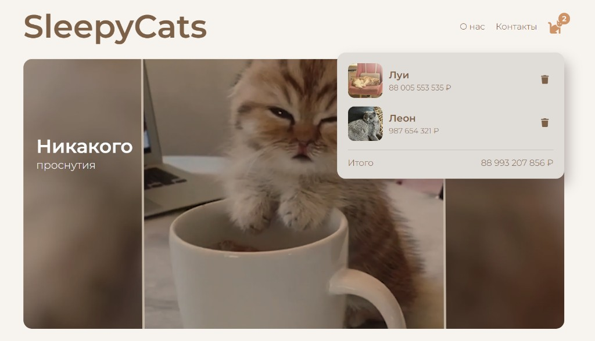
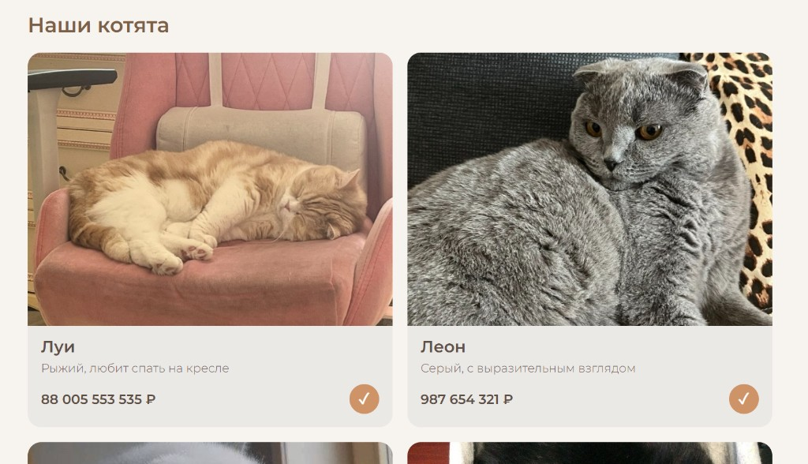

<p align="center">
  
</p>

<h1 align="center">SleepyCats</h1>

<p align="center">
  <strong>Мини-магазин котят с корзиной на React</strong><br/>
  <em>A tiny kitten shop with a shopping cart built in React</em>
</p>

<p align="center">
  Каталог · корзина · Docker · CI/CD в Docker Hub
</p>

<p align="center">
  
  
  
  
</p>

---

## О проекте

**SleepyCats** — одностраничный интернет-магазин котят: каталог с фото и ценами, корзина с итогом и сохранением в браузере. Учебный frontend-проект: компонентный React, локальный state и контейнеризация.

Идея в интерфейсе: мягкая «сонная» атмосфера (hero со спящим котёнком и слоганом «Никакого проснутия») и простая покупка без бэкенда.

| | |
| --- | --- |
| **Тип** | SPA (Single Page Application) |
| **Стек** | React 19, Create React App, react-icons |
| **Данные** | каталог в коде, корзина в `localStorage` |
| **Деплой** | multi-stage Docker + GitHub Actions → Docker Hub |

---

## Скриншоты

<p align="center">
  
</p>
<p align="center">
  <em>Шапка, hero «Никакого проснутия» и корзина с итогом</em>
</p>

<p align="center">
  
</p>
<p align="center">
  <em>Каталог: фото, описание, цена и статус «в корзине»</em>
</p>

---

## Возможности

### Каталог
- карточки с фото, именем, описанием и ценой
- добавление в корзину кнопкой «+» (после добавления — «✓»)

### Корзина
- открытие/закрытие по иконке кота, бейдж с количеством
- миниатюры, цены и сумма «Итого»
- удаление позиции, без дублей одного котёнка
- сохранение в `localStorage` между перезагрузками
- пустое состояние с подсказкой

### Оформление
- шапка, hero-баннер, адаптивная сетка под мобильные
- футер с копирайтом

---

## Как устроено

```text
┌─────────────────────────────────────────┐
│                 App                     │
│  state: items[] + orders[]              │
│  addToOrder / deleteOrder               │
└───────┬─────────────────┬───────────────┘
        │                 │
        ▼                 ▼
   ┌─────────┐      ┌──────────┐
   │ Header  │      │  Items   │
   │ + cart  │      │  → Item  │
   │ → Order │      └──────────┘
   └─────────┘
        │
        ▼
   ┌─────────┐
   │ Footer  │
   └─────────┘
```

- **`App`** — владелец данных: каталог и корзина, запись в `localStorage`.
- **`Header`** — логотип, меню, корзина с бейджем и итогом.
- **`Items` / `Item`** — сетка карточек с фото и ценой.
- **`Order`** — строка в корзине с удалением.
- **`Footer`** — копирайт.

Бэкенда нет: каталог зашит в коде, корзина живёт в браузере.

---

## Стек технологий

<details>
<summary><strong>Frontend</strong></summary>

- JavaScript, React 19 (class- и functional-компоненты)
- Create React App (`react-scripts`)
- `react-icons` (иконки корзины и удаления)
- CSS + Google Fonts (Montserrat)

</details>

<details>
<summary><strong>Инфраструктура</strong></summary>

- Docker multi-stage: `npm run build` + `serve` production-сборки
- GitHub Actions: сборка и push образа в Docker Hub при пуше в `main`

</details>

---

## Структура репозитория

```text
SleepyCats/
├── public/
│   └── index.html
├── src/
│   ├── App.js                 # каталог, корзина, обработчики
│   ├── index.js
│   ├── index.css              # стили и hero-баннер
│   ├── img/                   # hero + фото котят
│   └── components/
│       ├── Header.js          # шапка + корзина
│       ├── Items.js / Item.js # каталог
│       ├── Order.js           # позиция в корзине
│       └── Footer.js
├── docs/
│   └── screenshots/           # скриншоты для README
├── .github/workflows/
│   └── deploy.yaml            # CI/CD → Docker Hub
├── dockerfile
├── package.json
└── README.md
```

---

## Быстрый старт

### Локально (Node.js)

```bash
npm install
npm start
```

Приложение откроется на [http://localhost:3000](http://localhost:3000).

### Через Docker

```bash
docker build . -t sleepycats
docker run -d -p 3000:3000 sleepycats
```

Откройте [http://localhost:3000](http://localhost:3000).

### Образ с Docker Hub

```bash
docker pull ariabochkina/sleepycats
docker run -d -p 3000:3000 ariabochkina/sleepycats
```

> После переименования тега в CI новый образ появится в Docker Hub при следующем пуше в `main` (нужны secrets `USER_NAME` и `PASSWORD`). Старый тег `ariabochkina/test` мог остаться от прошлых сборок.

---

## Результаты

- рабочий SPA-магазин с каталогом и корзиной на React
- понятная компонентная структура и локальный state
- Docker-образ и автоматическая публикация через GitHub Actions

### Что можно развить дальше

1. фильтры и поиск по каталогу  
2. оформление заказа и форма контактов  
3. настоящий API / backend  
4. тесты компонентов  

---

<p align="center">
  <em>Никакого проснутия — только SleepyCats</em>
</p>
